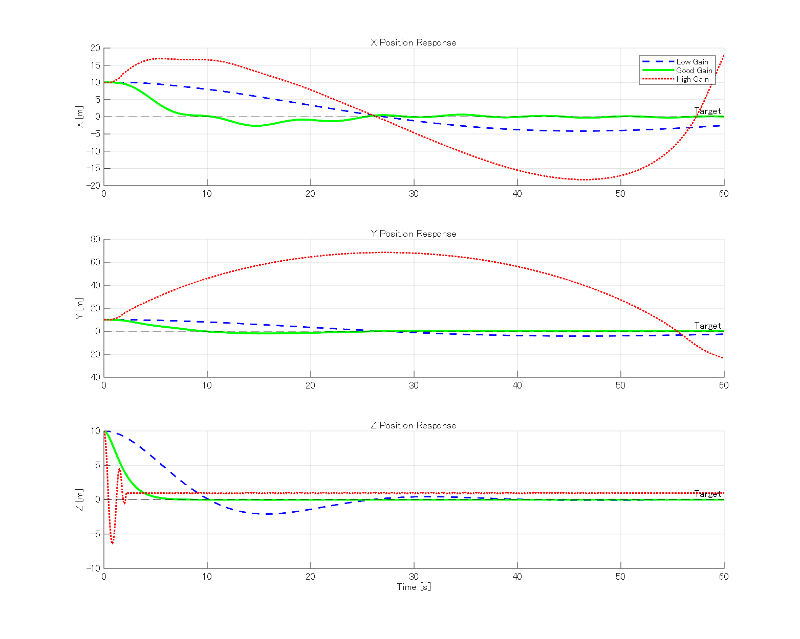

# 機械動力学 最終レポート
**テーマ：クアッドコプターの動的モデリングとカスケード位置制御系の設計**

氏名: （氏名を記入）
日付: 2026年2月2日

---

## 1. 緒言
### 1.1 背景
無人航空機（UAV）、特にクアッドコプターは、その高い機動性とホバリング能力から、空撮、点検、物流など多岐にわたる分野で利用されている。クアッドコプターは4つのロータの推力バランスを調整することで飛行する**劣駆動システム**（入力数 < 自由度数）であり、その制御系設計は工学的興味深い課題である。
一般に、クアッドコプターの制御系は、高速なダイナミクスを持つ「姿勢制御（内側ループ）」と、比較的低速な「位置制御（外側ループ）」の**カスケード構造**をとる。この構造において、位置制御系は機体の傾き（ロール・ピッチ角）を操作量として利用するため、適切なゲイン設定を行わない場合、系の不安定化や振動的な挙動を招くリスクがある。

### 1.2 目的
本レポートの目的は以下の通りである。
1. ラグランジュ形式に基づき、クアッドコプターの6自由度非線形運動方程式を導出する。
2. 位置制御（外側）と姿勢制御（内側）からなるカスケードPD制御系を設計・実装する。
3. 陰的統合ソルバー（Newmark-$\beta$法）を用いた数値シミュレーションを構築する。
4. 位置制御ゲインを変更した際のステップ応答特性を解析し、最適な制御パラメータを選定する。

---

## 2. 数理モデリング

### 2.1 座標系の定義
基本的な座標系として、地上に固定された**慣性座標系** $\Sigma_I = \{O_I; X_I, Y_I, Z_I\}$ と、機体重心に固定された**機体座標系** $\Sigma_B = \{O_B; x_b, y_b, z_b\}$ を定義する。
機体座標系の基準姿勢からの回転は、Z-Y-Xオイラー角（ヨー $\psi$ $\to$ ピッチ $\theta$ $\to$ ロール $\phi$）によって表現する。

#### 一般化座標
一般化座標ベクトル $\mathbf{q}$ は、慣性系における重心位置 $\mathbf{X} = [x, y, z]^T$ とオイラー角 $\boldsymbol{\eta} = [\phi, \theta, \psi]^T$ の計6成分とする。
$$ \mathbf{q} = \begin{bmatrix} x & y & z & \phi & \theta & \psi \end{bmatrix}^T $$

### 2.2 角速度ベクトル
オイラー角の時間微分 $\dot{\boldsymbol{\eta}}$ と機体座標系における角速度ベクトル $\boldsymbol{\omega} = [p, q, r]^T$ の関係は、回転行列を用いて以下のように記述される（具体的な導出結果）。

$$
\boldsymbol{\omega} = \begin{bmatrix}
\dot{\phi} - \dot{\psi}\sin\theta \\
\dot{\theta}\cos\phi + \dot{\psi}\cos\theta\sin\phi \\
\dot{\psi}\cos\phi\cos\theta - \dot{\theta}\sin\phi
\end{bmatrix}
$$

### 2.3 ラグランジュの運動方程式
運動エネルギー $K$ は並進成分と回転成分の和である。
$$ K = \frac{1}{2} m \dot{\mathbf{X}}^T \dot{\mathbf{X}} + \frac{1}{2} \boldsymbol{\omega}^T \mathbf{J} \boldsymbol{\omega} $$
ここで、$\mathbf{J} = \text{diag}(J_{xx}, J_{yy}, J_{zz})$ は機体座標系における慣性テンソルである。ポテンシャルエネルギー $U$ は重力のみを考慮して $U = mgz$ とする。

ラグランジアン $L = K - U$ に対し、オイラー・ラグランジュ方程式
$$ \frac{d}{dt} \left( \frac{\partial L}{\partial \dot{\mathbf{q}}} \right) - \frac{\partial L}{\partial \mathbf{q}} = \mathbf{Q} $$
を適用することで、以下の形式の運動方程式を得る。

$$ \mathbf{M}(\mathbf{q})\ddot{\mathbf{q}} + \mathbf{C}(\mathbf{q}, \dot{\mathbf{q}}) + \mathbf{G}(\mathbf{q}) = \mathbf{Q} $$

ここで、$\mathbf{M}$ は質量行列、$\mathbf{C}$ はコリオリ・遠心力項、$\mathbf{G}$ は重力項である。
質量行列の回転部分（サブマトリクス）の実装結果を以下に示す。

$$
\mathbf{M}_{rot} = \begin{bmatrix}
J_{xx} & 0 & -J_{xx}\sin\theta \\
0 & J_{yy}\cos^2\phi + J_{zz}\sin^2\phi & (J_{yy}-J_{zz})\sin\phi\cos\phi\cos\theta \\
-J_{xx}\sin\theta & (J_{yy}-J_{zz})\sin\phi\cos\phi\cos\theta & J_{zz}\cos^2\theta\cos^2\phi + J_{yy}\cos^2\theta\sin^2\phi + J_{xx}\sin^2\theta
\end{bmatrix}
$$
(※ Matlab Symbolic Toolboxによる単純化出力に基づく)

---

## 3. 制御系設計

### 3.1 カスケード制御構造
本システムでは以下の2段階のループを構成する。

1.  **位置制御器 (Outer Loop)**:
    現在の位置誤差 $(x_{ref}-x, y_{ref}-y)$ から、機体を移動させるために必要な**目標推力ベクトル**を算出する。その推力方向を実現するための**目標姿勢角** $(\phi_{cmd}, \theta_{cmd})$ を計算する。

2.  **姿勢制御器 (Inner Loop)**:
    目標姿勢角 $(\phi_{cmd}, \theta_{cmd}, \psi_{cmd})$ と現在の姿勢との誤差に基づき、各ロータへの制御トルク $\boldsymbol{\tau}$ を算出する。

### 3.2 制御則の詳細
#### 位置制御 (PD制御)
位置・速度誤差に対し、以下のフィードバックを行う。
$$ \mathbf{a}_{cmd} = K_{P,pos} (\mathbf{X}_{ref} - \mathbf{X}) + K_{D,pos} (\dot{\mathbf{X}}_{ref} - \dot{\mathbf{X}}) $$
ここで算出された加速度指令より、必要な総推力 $U_1$ と仮想的な水平力が求まる。これを微少角近似または回転行列の逆算により、目標ピッチ・ロール角に変換する。
$$ \theta_{cmd} \approx \frac{F_{x,des}}{U_1}, \quad \phi_{cmd} \approx -\frac{F_{y,des}}{U_1} $$

#### 姿勢制御 (PD制御)
内外のループで帯域を分離するため、姿勢制御ゲインは位置制御ゲインより十分に高く設定する。
$$ \boldsymbol{\tau} = K_{P,att} (\boldsymbol{\eta}_{cmd} - \boldsymbol{\eta}) - K_{D,att} \dot{\boldsymbol{\eta}} $$

---

## 4. 数値解析手法（シミュレーション実装）

剛体運動の数値積分には、エネルギー保存性が良く安定性の高い**Newmark-$\beta$法**（陰解法）を採用した。

### 4.1 時間更新アルゴリズム
時刻 $t$ から $t+h$ への更新において、以下の平均加速度法（$\gamma=0.5, \beta=0.25$）を用いた。

**Predictor (予測):**
$$ \dot{\mathbf{q}}_{n+1} = \dot{\mathbf{q}}_n + h ( (1-\gamma)\ddot{\mathbf{q}}_n + \gamma\ddot{\mathbf{q}}_{n+1} ) $$
$$ \mathbf{q}_{n+1} = \mathbf{q}_n + h\dot{\mathbf{q}}_n + h^2 ( (0.5-\beta)\ddot{\mathbf{q}}_n + \beta\ddot{\mathbf{q}}_{n+1} ) $$

これらを運動方程式 $\mathbf{R}(\mathbf{q}_{n+1}, \dot{\mathbf{q}}_{n+1}, \ddot{\mathbf{q}}_{n+1}) = \mathbf{M}\ddot{\mathbf{q}} + \mathbf{C} + \mathbf{G} - \mathbf{Q} = \mathbf{0}$ に代入し、残差 $\mathbf{R}$ がゼロになるような加速度 $\ddot{\mathbf{q}}_{n+1}$ を**Newton-Raphson法**により反復探索する。

**Jacobian近似と修正:**
反復 $k$ における修正量 $\Delta \ddot{\mathbf{q}}$ は次式で求める。
$$ \Delta \ddot{\mathbf{q}} = - \left( \frac{\partial \mathbf{R}}{\partial \ddot{\mathbf{q}}} \right)^{-1} \mathbf{R} \approx - \mathbf{M}^{-1} \mathbf{R} $$

---

## 5. シミュレーション条件

| パラメータ | 値 | 単位 | 備考 |
|---|---|---|---|
| 質量 $m$ | 0.7 | kg | |
| 慣性 $J_{xx}$ | 0.010 | kg m$^2$ | |
| 慣性 $J_{yy}$ | 0.015 | kg m$^2$ | |
| 慣性 $J_{zz}$ | 0.020 | kg m$^2$ | |
| 重力 $g$ | 9.81 | m/s$^2$ | |
| 時間刻み $h$ | 0.01 | s | |
| 初期位置 | $[10, 10, 10]$ | m | ステップ応答 |
| 目標位置 | $[0, 0, 0]$ | m | 原点への復帰 |

### 比較ケース（位置制御ゲイン）
姿勢ゲインは固定 ($K_P=6.0, K_D=2.5$) とし、位置ゲインのみを変更する。

- **Case 1 (Low Gain)**: $K_P=0.005, K_D=0.04$
- **Case 2 (Optimal)**: $K_P=0.04, K_D=0.2$
- **Case 3 (High Gain)**: $K_P=5.0, K_D=0.1$

---

## 6. 結果と考察

### 6.1 時刻歴応答結果
3次元位置 $(X, Y, Z)$ のシミュレーション結果を下図１に示す。

図1: 位置制御シミュレーション結果（Case 1～3）
### 6.2 考察
1.  **過減衰と応答遅れ (Case 1)**
    ゲインが低い場合、位置偏差に対する復元力が弱いため、目標への収束に60秒以上を要している。これは実用的ではなく、風などの外乱に対して位置を維持できない可能性が高い。

2.  **振動と不安定化 (Case 3)**
    位置ゲインを過大に設定すると、目標傾斜角が急激に変動する。内側の姿勢制御ループの帯域（応答速度）がこれに追従できず、結果として機体が激しく振動する現象が見られた。これはカスケード制御における「内側ループは外側ループより十分に高速でなければならない」という原則を逸脱したためである。

3.  **最適パラメータ (Case 2)**
    Case 2では、約15秒程度でオーバーシュートなく目標位置へ収束している。これは減衰比 $\zeta$ が適切（$\zeta \approx 0.7 \sim 1.0$）に設定されていることを示唆する。

### 6.3 結論
本研究により、6自由度クアッドコプターの非線形シミュレーション環境を構築し、位置制御系の設計指針を得た。特に、カスケード構造においては内外ループの帯域分離が重要であり、単にゲインを上げるだけでは高速な応答は得られず、逆に系を不安定にすることを確認した。
