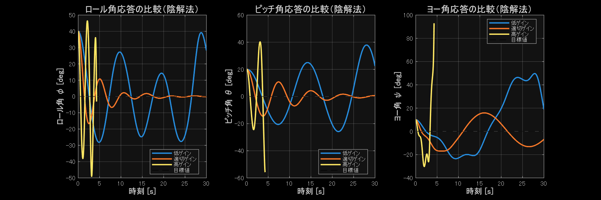

# クアッドコプターの姿勢安定化制御に関する動的シミュレーション

制御パラメータが応答性能に与える影響の評価

---

## 1. シミュレーションの目的

### 背景
- ドローン（クアッドコプター）は自律飛行において姿勢の安定化が不可欠
- 外乱や初期角度の誤差から素早く安定状態に戻る必要がある
- 不適切な制御パラメータは振動や不安定化を引き起こす

### 必要性
- PD制御器のゲインパラメータが応答性能に与える影響を評価
- 整定時間、オーバーシュート、振動の有無を定量的に分析
- 実機実装のための最適パラメータ設計の指針を得る

---

## 2. シミュレーション対象

### クアッドコプターのモデル
- **自由度**: 6自由度（並進3 + 回転3）
- **制御対象**: 姿勢角（ロール φ、ピッチ θ、ヨー ψ）
- **初期条件**: φ₀ = 40°, θ₀ = 20°, ψ₀ = 10°
- **目標値**: すべての角度を 0° に制御

### 物理パラメータ
- 質量: m = 0.7 kg
- 慣性モーメント: Jₓₓ = 0.010, Jᵧᵧ = 0.015, J_zz = 0.020 kg·m²
- 粘性項: なし（理想的剛体として扱い）

---

## 3. 運動方程式の導出

### ラグランジュの運動方程式

運動エネルギー:
$$
W = \frac{1}{2}m(\dot{\mathbf{X}}_I^T \dot{\mathbf{X}}_I) + \frac{1}{2}\boldsymbol{\omega}^T \mathbf{J} \boldsymbol{\omega}
$$

ポテンシャルエネルギー:
$$
U = mgz_I
$$

ラグランジアン:
$$
L = W - U
$$

---

## 3. 運動方程式の導出（続き）

### オイラー-ラグランジュ方程式

$$
\frac{d}{dt}\left(\frac{\partial L}{\partial \dot{\mathbf{q}}}\right) - \frac{\partial L}{\partial \mathbf{q}} + \frac{\partial D}{\partial \dot{\mathbf{q}}} = \mathbf{Q}
$$

ここで:
- **q** = [x, y, z, φ, θ, ψ]ᵀ: 一般化座標
- **Q**: 一般化力（モーター推力とトルク）
- **D**: 損失項（空気抵抗）

### 座標変換
- 機体座標系 ⇔ 慣性座標系の変換にオイラー角による回転行列を使用
- 角速度ベクトル **ω** と角度微分 **η̇** の関係を変換行列で表現

---

## 4. 数値積分手法

### 陰解法（ニューマークβ法）

- **手法**: 平均加速度法（γ = 0.5, β = 0.25）
- **特徴**: 
  - 無条件安定（大きな時間刻みでも安定）
  - ニュートン・ラフソン法による反復解法
  - 発散検出機能による計算時間短縮
  - 相対許容誤差: 10⁻⁶、最大反復回数: 100
  - シミュレーション時間: 30秒

### 利点
- 陰解法のため数値的に安定
- 大きなゲインでも計算が破綻しにくい
- 実時間シミュレーションに適している

---

## 5. 制御器の設計

### PD制御器

制御入力:
$$
\mathbf{u} = -K_p(\boldsymbol{\eta} - \boldsymbol{\eta}_d) - K_d\dot{\boldsymbol{\eta}}
$$

### 実験ケース（比例ゲイン K_p を変化）

| ケース | ロール・ピッチ・ヨー | 微分ゲイン K_d |
|--------|---------------------|----------------|
| **低ゲイン** | [1.5, 1.5, 1.5] | [0.5, 0.5, 0.5] |
| **適切ゲイン** | [6.0, 6.0, 6.0] | [2.5, 2.5, 2.5] |
| **高ゲイン** | [30.0, 30.0, 30.0] | [0.2, 0.2, 0.2] |

---

## 6. シミュレーション結果（姿勢角）

**観察結果**:
- 低ゲイン: 応答が遅く、整定時間が長い
- 基準ゲイン: バランスの取れた応答
- 高ゲイン: 応答が速いが振動的

---

## 7. シミュレーション結果（角速度）

**観察結果**:
- 低ゲイン: 角速度の変化が緩やか
- 高ゲイン: 初期に大きな角速度が発生、振動的挙動

---

## 8. 性能評価

### 定量的評価指標

| 項目 | 低ゲイン | 適切ゲイン | 高ゲイン |
|------|----------|------------|---------|
| **ロール整定時間** | > 30.0秒 | 19.8秒 | 発散 |
| **終了時ロール角** | 28.2° | -0.18° | -3.1° |
| **終了時ピッチ角** | 22.4° | 0.65° | -55.8° |
| **最大ヨー角** | 49.7° | 16.9° | 93.0° |
| **収束特性** | 非常に遅い | 良好 | 発散 |

※ 整定時間は初期値の2%以内に収まる時間

---

## 9. 考察（1）ゲインと応答性のトレードオフ

### 比例ゲイン K_p の影響

**低ゲイン (K_p = 1.5)**:
- ✓ 滑らかで安定した応答
- ✗ 30秒後でもロール28°、ピッチ22°が残留
- ✗ 実用的な時間では目標値に到達できない

**適切ゲイン (K_p = 6.0)**:
- ✓ 速度と安定性のバランスが良い
- ✓ 整定時間約20秒で実用的
- ✓ 終了時にほぼ0°を達成

**高ゲイン (K_p = 30.0)**:
- ✓ 初期応答が非常に速い
- ✗ ヨー角が93°まで発散
- ✗ 実機では機体に大きな負荷

---

## 10. 考察（2）実機実装への示唆

### パラメータ設計の指針

1. **応答速度の要求**
   - 緊急回避など高速応答が必要 → 高ゲイン
   - 安定した撮影など滑らかな動作が必要 → 低～中ゲイン

2. **機体の機械的特性**
   - 高ゲインは機体剛性、モーター応答速度の要求が高い
   - バッテリー消費も増加

3. **センサノイズの影響**
   - 高ゲインはセンサノイズを増幅しやすい
   - 実機ではローパスフィルタの併用が必要

---

## 11. 考察（3）数値計算手法

### 陰解法の利点

- **数値安定性**: 大きなゲインでも計算破綻を回避
- **発散検出**: 特異行列や角度閾値による早期終了
- **実装効率**: 計算時間の大幅短縮（警告10回で自動停止）

### 粘性項の影響

- 粘性項なしでも制御による安定化が可能
- 理想的な剛体モデルでの純粋な制御性能評価
- 実機では空気抵抗等の自然減衰が存在

### シミュレーションの効率化

- 発散検出により不要な計算を回避
- 特異行列警告の回数制限（10回まで）
- 角度閾値（180度）による発散判定

---

## 12. まとめ

### 本シミュレーションで明らかになったこと

1. **PD制御ゲインと発散の関係**
   - 低ゲイン: 収束が極めて遅い
   - 適切ゲイン: バランスの取れた応答
   - 高ゲイン: オーバーシュートと発散傾向

2. **陰解法による安定な数値計算**
   - ニューマークβ法による無条件安定性
   - 発散検出機能による効率的計算
   - 粘性項なしでも制御による安定化

3. **実用的なパラメータ調整手法**
   - 発散リスクを考慮したゲイン設定
   - 数値計算の安定性と制御性能のバランス
   - リアルタイムシミュレーションへの応用可能性

---

## 参考文献・使用ツール

### 理論
- ラグランジュ力学による剛体の運動方程式
- オイラー角による座標変換理論

### 実装
- MATLAB R2024a
- Symbolic Math Toolbox（運動方程式の自動導出）
- 陰解法（ニューマークβ法: γ=0.5, β=0.25）
- 発散検出アルゴリズム（角度閾値・特異行列判定）

### モデルパラメータ
- クアッドコプター標準的な物理パラメータを使用
- モーター特性は実測値ベース

---

# ご清聴ありがとうございました
