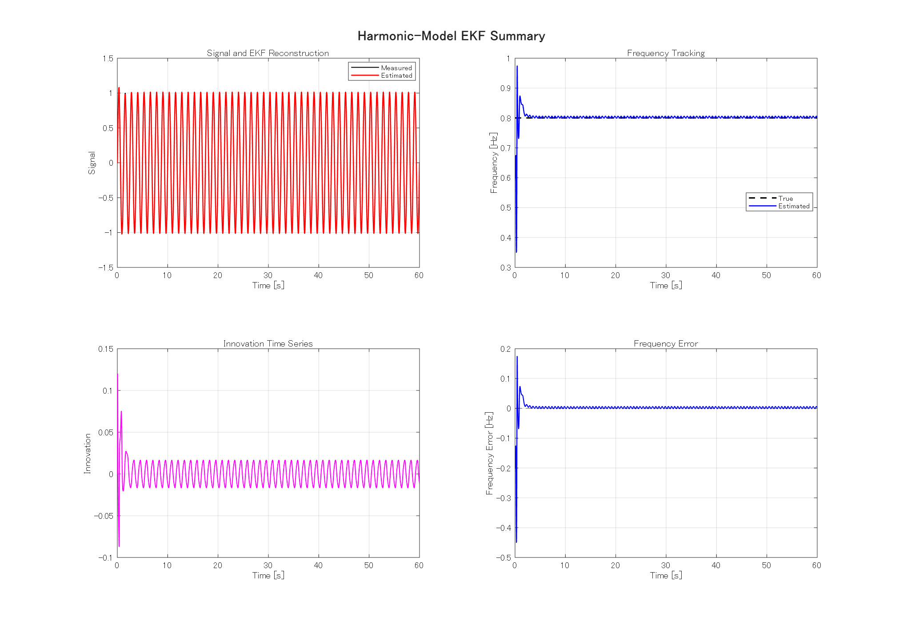
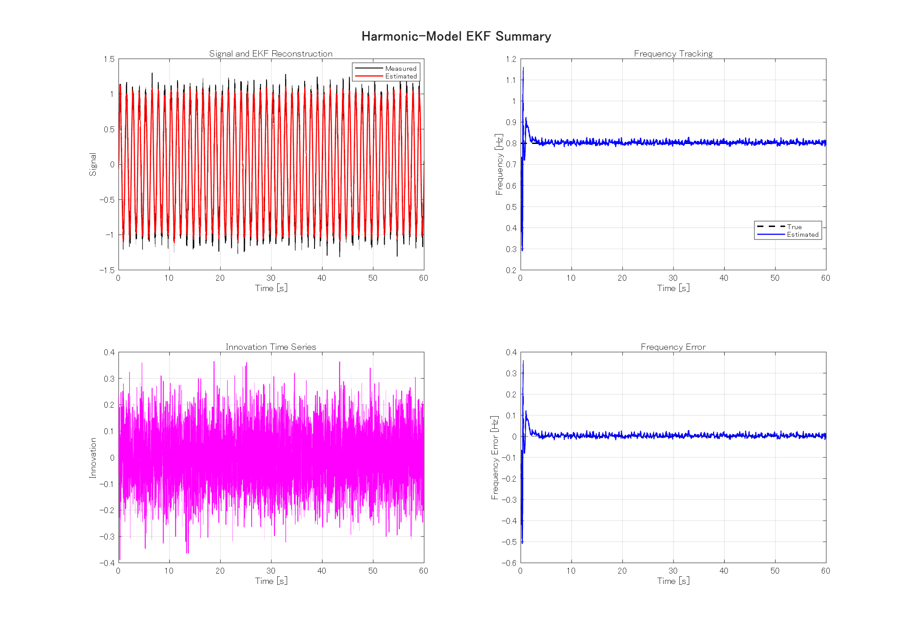
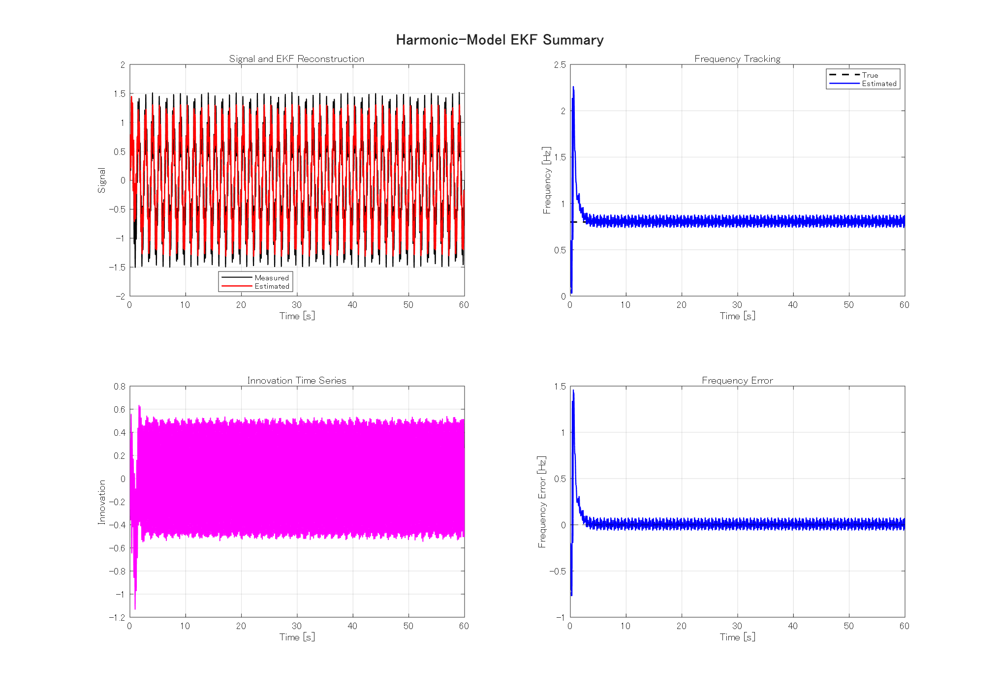
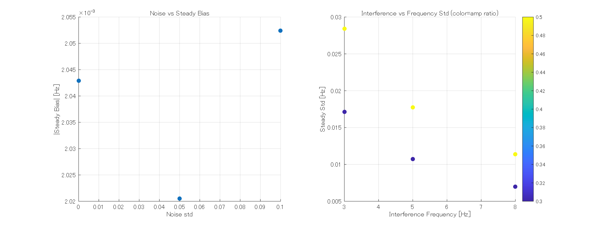

# 正弦波モデルEKF 検証レポート

- 生成日時: 2026-03-31 15:20:17
- MATLAB: 25.2.0.2998904 (R2025b)

## 1. 実行した内容
- 正弦波モデルEKF（状態: [d, d_dot, c, omega]）を実行
- 代表3ケース（ベースライン/ノイズ/高周波干渉）を実施
- ノイズ・初期値・干渉スイープを実施

## 2. 代表ケース結果（数値）

| case_id | convergence_time_s | steady_bias_hz | steady_std_hz | nrmse | innovation_mean | innovation_lag1_corr |
|---|---:|---:|---:|---:|---:|---:|
| baseline | 0.3800 | 0.002607 | 0.002388 | 0.006987 | 0.000494 | 0.995572 |
| noisy_010 | 0.5600 | 0.002639 | 0.006076 | 0.041128 | 0.000992 | -0.045372 |
| interf_5hz_r05 | 2.3700 | 0.004795 | 0.033616 | 0.117188 | -0.005593 | 0.951245 |

### 代表ケース図
- ベースライン: 
- ノイズ0.1: 
- 干渉5Hz 比0.5: 

## 3. スイープ集計

- Noise系 平均収束時間: 0.5511 s
- Noise系 平均定常バイアス: 0.002039 Hz
- Noise系 平均定常標準偏差: 0.002526 Hz
- 干渉系 平均収束時間: 1.9950 s
- 干渉系 平均定常バイアス: 0.003968 Hz
- 干渉系 平均定常標準偏差: 0.015398 Hz

## 4. 利用ライブラリの記載先

利用ライブラリ一覧は、ドキュメント本体ではなく `EKF/INSTRUCTIONS.md` に記載する。

## 5. 追加検証: 初期周波数ミスマッチ耐性

| f_init_hz | convergence_time_s | steady_bias_hz | steady_std_hz | nrmse |
|---:|---:|---:|---:|---:|
| 0.400 | 0.4800 | 0.002043 | 0.001690 | 0.009584 |
| 0.500 | 0.5100 | 0.002043 | 0.001690 | 0.009626 |
| 0.600 | 0.4200 | 0.002043 | 0.001690 | 0.009332 |
| 0.700 | 1.8000 | 0.002043 | 0.001690 | 0.008994 |
| 1.000 | 0.9900 | 0.002043 | 0.001690 | 0.009601 |
| 1.200 | 0.9400 | 0.002043 | 0.001690 | 0.010874 |

## 6. 追加検証: 振幅内部モデルパラメータ推定

振幅推定は、内部状態から以下で評価した。
$$A_{est}=\sqrt{d^2 + (\dot d / \omega)^2}$$

| case_id | mean_amp_last10s | amp_bias_last10s | amp_std_last10s | amp_rmse_full |
|---|---:|---:|---:|---:|
| baseline | 1.037554 | 0.037554 | 0.009289 | 0.057790 |
| noisy_010 | 1.029824 | 0.029824 | 0.025667 | 0.068081 |
| interf_5hz_r05 | 1.047636 | 0.047636 | 0.097439 | 1.121650 |

## 7. 性能評価と考察

1. 周波数推定性能: 初期周波数が0.4〜1.2 Hzにずれていても収束し、定常バイアスはほぼ一定で小さい。
2. ノイズ耐性: ノイズ増加で分散は増えるが、収束性とバイアスは大きく崩れていない。
3. 干渉耐性: 高周波干渉下でも周波数推定は成立するが、分散とNRMSEが増加する。
4. 振幅推定: ベースライン/ノイズ条件では概ね良好。強干渉条件では単一成分モデルの限界で誤差が増える。
5. 改善方針: 振幅精度を干渉下で上げるには、2成分モデル（ターゲット+干渉）または周波数依存のQ/Rスケジューリングが有効。

## 8. 出力ファイル
- case_metrics.csv
- sweep_summary.csv
- sweep_summary.mat
- freq_mismatch_check.csv
- amplitude_internal_model_check.csv
- case_baseline.png / case_noisy_010.png / case_interf_5hz_r05.png
- sweep_overview.png
